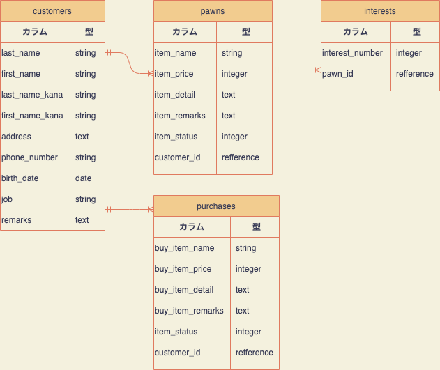

# README

## アプリケーション名
Pawnshop- Manager

## アプリケーション概要
このアプリケーションは、質店の業務管理を目的としたアプリケーションです。
質入れ処理・利息管理・質返還処理・質流れ処理・買取処理・データ検索及び編集ができます。

## URL
https://github.com/grenade- Y- O- S/pawnshop_manager_35778

## 利用方法
ログインなどは必要なく、すぐにご利用いただけます。

## 目指した課題解決
質店は独特なシステムを用いて運営されており、扱う情報量が多いのでデータ管理をスムーズに行う事を目的として開発しました。

## 洗い出した要件
### 実装したい機能 / 要件(※背景色は、そのページの背景色と同じ色)
- トップページ

【ボタン】
・「入質」「利息」「買取」「質返還」「質流れ」「データ検索」のページへ遷移できるボタンがある

【表示】
・上記のボタンのみが表示される

- 入質ページ

【ボタン】
・新規客データを登録するページへ遷移できるボタンがある
・リピーター客のデータを検索するページへ遷移できるボタンがある
・トップページへ遷移できるボタンがある

【表示】
・上記のボタンのみが表示される

- 新規客データ登録ページ

【フォーム】
・入力項目
「姓」「名前」「姓(カタカナ)」「名前(カタカナ)」「住所」「電話番号」「生年月日」「職業」「備考」

【ボタン】
・新規客データを登録し、質データまたは買取データを登録するページへ遷移できるボタンがある
(遷移元が入質ページならば質データ登録ページへ、買取ページならば買取データ登録ページへ遷移する)
・入質ページへ遷移できるボタンがある
・トップページへ遷移できるボタンがある

- リピーター客データ検索ページ

【検索フォーム】
・検索項目をプルダウンで選択
「客番号(客データID)」「姓(漢字)」「姓(カタカナ)」
・検索キーワードを入力

【ボタン】
・検索項目を選択し、質データまたは買取データを登録するページへ遷移できるボタンがある
(遷移元が入質ページならば質データ登録ページへ、買取ページならば買取データ登録ページへ遷移する)
・入質ページへ遷移できるボタンがある
・トップページへ遷移できるボタンがある

- 質データ登録ページ

【フォーム】
・入力項目
「品物名」「金額」「詳細」「備考」

【ボタン】
・質データを登録し、入力した客・質データを表示するページへ遷移できるボタンがある
・トップページへ遷移できるボタンがある

- 質登録データ表示ページ

【ボタン】
・トップページへ遷移できるボタンがある

【表示】
・登録した客データと質データを表示する

- 買取ページ

【ボタン】
・新規客データを登録するページへ遷移できるボタンがある
・リピーター客のデータを検索するページへ遷移できるボタンがある
・トップページへ遷移できるボタンがある

【表示】
・上記のボタンのみが表示される

- 買取データ登録ページ

【フォーム】
・入力項目
「品物名」「金額」「詳細」

【ボタン】
・買取データを登録し、入力した客・買取データを表示するページへ遷移できるボタンがある
・トップページへ遷移できるボタンがある

- 買取登録データ表示ページ
【ボタン】
・トップページへ遷移できるボタンがある

【表示】
・登録した客データと買取データを表示する

- 利息検索ページ

【検索フォーム】
・検索項目をプルダウンで選択
「客番号(客データID)」「姓(漢字)」「姓(カタカナ)」
・検索キーワードを入力
・利息データを紐づける質データを検索する

【ボタン】
・検索結果を表示するページへ遷移できるボタンがある
・トップページへ遷移できるボタンがある

- 利息検索結果表示ページ

【ボタン】
・表示された質データの中から、利息データと紐づけるものを選択し、利息データ入力ページへ遷移できるボタンがある
・質データを検索するページへ遷移できるボタンがある
・トップページへ遷移できるボタンがある

【表示】
・検索した質データが一覧表示される

- 利息データ登録ページ

【フォーム】
・入力項目
「利息回数」

【ボタン】
・利息データを登録し、入力した利息データと紐づけた質データを表示するページへ遷移できるボタンがある
・質データを検索するページへ遷移できるボタンがある
・トップページへ遷移できるボタンがある

【表示】
・紐づけた質データを表示する

- 利息登録データ表示ページ

【ボタン】
・登録した利息データと、それにより変化した質の期限を表示するページへ遷移できるボタンがある
・質データを検索するページへ遷移できるボタンがある
・トップページへ遷移できるボタンがある

【表示】
・登録した利息データと、紐づけた質データが表示される
「質番号(質データID)」「客氏名(姓+名前)」「金額」「利息金額」「備考」「入質日」「これまでの利息合計」「期限」

- 質返還/質流れ検索ページ

【検索フォーム】
・検索項目をプルダウンで選択
「質番号(質データID)」「姓(漢字)」「姓(カタカナ)」
・検索キーワードを入力
・情報を変更する質データを検索する

【ボタン】
・検索結果を表示するページへ遷移できるボタンがある
(遷移元が質返還ボタンならば「返還済み」に、質流れボタンならば「質流れ」に状態を変更する。質流れに変更する時は背景色はグレー)
・トップページへ遷移できるボタンがある

- 質返還/質流れ検索結果表示ページ
【ボタン】
・表示された質データの中から、状態を変更するものを選択し、変更処理を行うページへ遷移できるボタンがある
・質データを検索するページへ遷移できるボタンがある
・トップページへ遷移できるボタンがある

【表示】
・検索した質データが一覧表示される

- 質返還/質流れ変更処理ページ

【ボタン】
・質データの状態を変更し、変更結果を表示するページへ遷移できるボタンがある
・質データを検索するページへ遷移できるボタンがある
・トップページへ遷移できるボタンがある

【表示】
・選択した質データと、それに紐づく客データが表示される

- 質返還/質流れ変更結果表示ページ

【ボタン】
・トップページへ遷移できるボタンがある

【表示】
・変更した質データと、それに紐づく客データが表示される

- データ検索ページ

【ボタン】
・客データ検索ページへ遷移できるボタンがある
・質データ検索ページへ遷移できるボタンがある
・利息データ検索ページへ遷移できるボタンがある
・買取データ検索ページへ遷移できるボタンがある
・トップページへ遷移できるボタンがある

【表示】
・上記のボタンのみが表示される

- 客データ検索ページ

【検索フォーム】
・検索項目をプルダウンで選択
「客番号(客データID)」「姓(漢字)」「姓(カタカナ)」
・検索キーワードを入力

【ボタン】
・データ検索ページへ遷移できるボタンがある
・トップページへ遷移できるボタンがある

- 客データ検索結果一覧ページ

【ボタン】
・客データを選択し、客データ編集ページへ遷移できるボタンがある
・客データ検索ページへ遷移できるボタンがある
・データ検索ページへ遷移できるボタンがある
・トップページへ遷移できるボタンがある

【表示】
・客データの検索結果一覧およびデータ編集ボタンが表示される

- 客データ編集ページ

【編集フォーム】
・客データの全項目を入力する

【ボタン】
・客データを編集し、その客データを表示するページへ遷移できるボタンがある
・客データ検索ページへ遷移できるボタンがある
・データ検索ページへ遷移できるボタンがある
・トップページへ遷移できるボタンがある

客データ編集結果表示ページ
【ボタン】
・トップページへ遷移できるボタンがある

【表示】
・編集した客データが表示される

- 質データ検索ページ

【検索フォーム】
・検索項目をプルダウンで選択
「質番号(質データID)」「姓(漢字)」「姓(カタカナ)」
・検索キーワードを入力

【ボタン】
・データ検索ページへ遷移できるボタンがある
・トップページへ遷移できるボタンがある

- 質データ検索結果一覧ページ

【ボタン】
・質データを選択し、質データ編集ページへ遷移できるボタンがある
・質データ検索ページへ遷移できるボタンがある
・データ検索ページへ遷移できるボタンがある
・トップページへ遷移できるボタンがある

【表示】
・質データの検索結果一覧およびデータ編集ボタンが表示される

- 質データ編集ページ

【編集フォーム】
・質データの全項目を入力する

【ボタン】
・質データを編集し、その質データを表示するページへ遷移できるボタンがある
・質データ検索ページへ遷移できるボタンがある
・データ検索ページへ遷移できるボタンがある
・トップページへ遷移できるボタンがある

- 質データ編集結果表示ページ
【ボタン】
・トップページへ遷移できるボタンがある

【表示】
・編集した質データが表示される

- 買取データ検索ページ
【検索フォーム】
・検索項目をプルダウンで選択
「買取番号(買取データID)」「姓(漢字)」「姓(カタカナ)」
・検索キーワードを入力

【ボタン】
・データ検索ページへ遷移できるボタンがある
・トップページへ遷移できるボタンがある

- 買取データ検索結果一覧ページ

【ボタン】
・買取データを選択し、買取データ編集ページへ遷移できるボタンがある
・買取データ検索ページへ遷移できるボタンがある
・データ検索ページへ遷移できるボタンがある
・トップページへ遷移できるボタンがある

【表示】
・買取データの検索結果一覧およびデータ編集ボタンが表示される

- 買取データ編集ページ

【編集フォーム】
・買取データの全項目を入力する

【ボタン】
・買取データを編集し、その買取データを表示するページへ遷移できるボタンがある
・買取データ検索ページへ遷移できるボタンがある
・データ検索ページへ遷移できるボタンがある
・トップページへ遷移できるボタンがある

- 買取データ編集結果表示ページ

【ボタン】
・トップページへ遷移できるボタンがある

【表示】
・編集した買取データが表示される

- 利息データ検索ページ

【検索フォーム】
・検索項目をプルダウンで選択
「利息番号(利息データID)」「質番号(質データID)」「姓(漢字)」「姓(カタカナ)」
・検索キーワードを入力

【ボタン】
・データ検索ページへ遷移できるボタンがある
・トップページへ遷移できるボタンがある

- 利息データ検索結果一覧ページ

【ボタン】
・利息データを選択し、利息データ編集ページへ遷移できるボタンがある
・利息データ検索ページへ遷移できるボタンがある
・データ検索ページへ遷移できるボタンがある
・トップページへ遷移できるボタンがある

【表示】
・利息データの検索結果一覧およびデータ編集ボタンが表示される

- 利息データ編集ページ

【編集フォーム】
・利息データを入力する

【ボタン】
・利息データを編集し、その利息データとそれに紐づく質データを表示するページへ遷移できるボタンがある
・利息データ検索ページへ遷移できるボタンがある
・データ検索ページへ遷移できるボタンがある
・トップページへ遷移できるボタンがある

- 利息データ編集結果表示ページ

【ボタン】
・トップページへ遷移できるボタンがある

【表示】
・編集した利息データと、それに紐づく質データが表示される

## データベース設計

## customersテーブル

| Column          | Type   | Options     |
| - - - - - - - - - - - - - - -  | - - - - - -  | - - - - - - - - - - -  |
| last_name       | string | null: false |
| first_name      | string | null: false |
| last_name_kana  | string | null: false |
| first_name_kana | string | null: false |
| address         | string | null: false |
| phone_number    | string | null: false |
| birth_date      | date   | null: false |
| job             | string | null: false |
| remarks         | text   |             |

### Association
-  has_many :pawns
-  has_many :purchases

## pawnsテーブル

| Column       | Type       | Options                        |
| - - - - - - - - - - - -  | - - - - - - - - - -  | - - - - - - - - - - - - - - - - - - - - - - - - - - - - - -  |
| item_name    | string     | null: false                    |
| item_price   | integer    | null: false                    |
| item_detail  | text       | null: false                    |
| item_remarks | text       |                                |
| item_status  | integer    | null: false                    |
| customer     | references | null: false, foreign_key: true |

### Association
-  belongs_to :customer
-  has_many   :interests

## interestsテーブル

| Column           | Type       | Options                        |
| - - - - - - - - - - - - - - - -  | - - - - - - - - - -  | - - - - - - - - - - - - - - - - - - - - - - - - - - - - - -  |
| interests_number | integer    | null: false                    |
| pawn             | references | null: false, foreign_key: true |

### Association
-  belongs_to :pawn

## purchasesテーブル

| Column          | Type       | Options                        |
| - - - - - - - - - - - - - - -  | - - - - - - - - - -  | - - - - - - - - - - - - - - - - - - - - - - - - - - - - - -  |
| buy_item_name   | string     | null: false                    |
| buy_item_price  | integer    | null: false                    |
| buy_item_detail | text       | null: false                    |
| customer        | references | null: false, foreign_key: true |

### Association
-  belongs_to :customer

## daily_work_checksテーブル

| Column       | Type | Options     |
| - - - - - - - - - - - -  | - - - -  | - - - - - - - - - - -  |
| message_time | time | null: false |

## gold_pricesテーブル

| Column       | Type    | Options     |
| - - - - - - - - - - - -  | - - - - - - -  | - - - - - - - - - - -  |
| k18_price    | integer | null: false |
| k14_price    | integer | null: false |
| k24_price    | integer | null: false |
| k18wg_price  | integer | null: false |
| k14wg_price  | integer | null: false |
| pt850_price  | integer | null: false |
| pt900_price  | integer | null: false |
| pt950_price  | integer | null: false |
| pt1000_price | integer | null: false |
